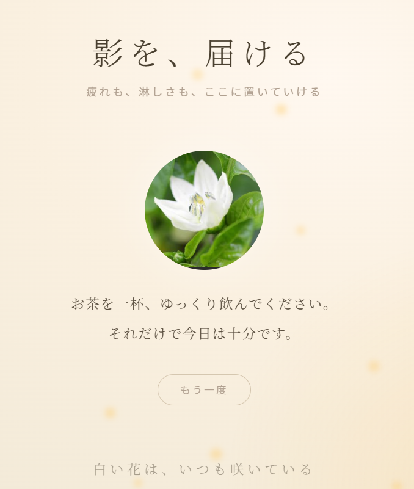
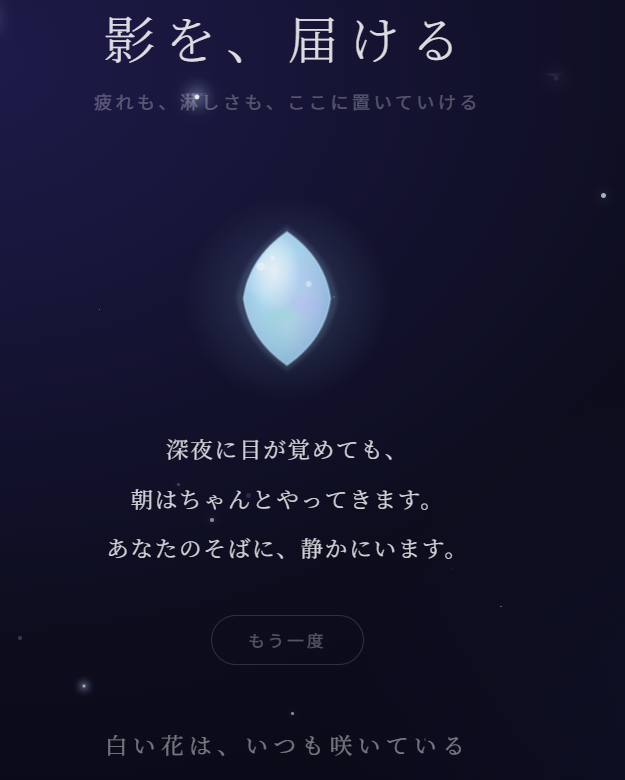

🌃影を、届ける

 自分の影を言葉にする。ただそれだけの場所。

 

  
  &nbsp;&nbsp;
  

 

---

このアプリについて

誰にも見せない。保存もしない。

ただ、自分の中にある**影**を、言葉にする。

それだけのために作られたアプリです。

---

🌃 体験する

👉 [https://shadow-19910310.lovable.app](https://shadow-19910310.lovable.app)

---

 💎使い方

言葉を入れる。  
影が、少し軽くなる。  
それだけ。

---

技術

- Vite + React + TypeScript
- shadcn/ui
- Lovable

---

  誰にも見せない。保存もしない。ただ、ここだけの言葉。

